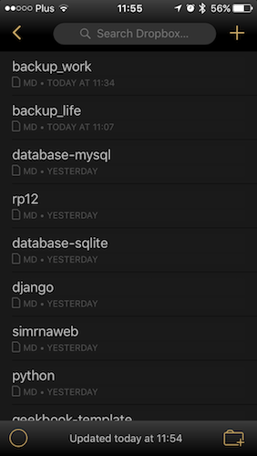

# geekbook

A neat way how to combine Emacs (not requried) + Markdown Syntax + Git + html engine (bootstrap/python) to get the best notes-talking experience ever. Highly customizable with plugins written in Python. What's the most important, under the hood it's just a set of Markdown files.. you can do with them whatever you want, e.g. you can Pandoc (http://pandoc.org/epub.html) them to epub (that's origin of "book" part of the name). 

Freatures:

- Index html based
- Sync them with Dropbox/iCloud/github
- Read from console, grep them
- Edit with almost any text editor, I'm using Emacs!
- Keep images separately, edit them in any external tool or edit them in batch
- Customize html templates
- You can sync notes in your system with notes kept at virtual machines (mounted via sshfs) or drives
- Super light!
- Pandoc markdown files to anything you want!

I recommend to use Emacs (or VIM or other super-powerfull editor) to:

- run git on your notes in your editor,
- grep them in the editor,
- make bookmarks to parts of your notes,
- copy-paste from your notes to your programs you're writing,

Kinda similar projects:

- www.geeknote.me

# Features
## Index

## Dashboard

## Use 3rd party software
if you wish, even on your phone (in this case using Dropbox & Byword on my iPhone).

## Long notes vs short notes

You can combine short notes into long ones.
